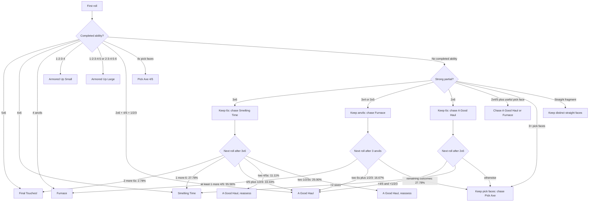

# Forgemaster roll tree

The CLI can precompute a value-prioritized opening tree for Forgemaster:

```powershell
dotnet run --project src\DiceThroneCli\DiceThroneCli.csproj -- rolltree --hero forgemaster --dice-count 5 --rerolls 2
```

The command emits one entry for every distinct five-dice opening pattern (252 entries). Each entry contains:

- `primaryObjective`: the recommended ability using the default defense-adjusted expected-value model;
- `keepFaces` and `rerollCount`: the first-roll decision;
- `completionProbability`: probability of completing that ability with optimal play;
- `expectedDelta`: value used for priority ordering;
- `fallbackObjective`: the best alternate damage line after preserving the primary keep;
- `nextRollSignals`: optional second-roll branches.

Add `--include-next-roll` to expand the selected opening pattern, and `--start-dice` to inspect one entry without expanding the entire tree:

```powershell
dotnet run --project src\DiceThroneCli\DiceThroneCli.csproj -- rolltree `
  --hero forgemaster --start-dice 1,2,6,6,6 --rerolls 2 --include-next-roll
```

## Reading the first-roll tree

The default ordering is expected delta, then completion probability, then opening frequency. That makes the tree value-first while retaining the safer line in the same node. It is not a claim that every game state has one universally correct action: cards, armor state, opponent defense, and the value of mining can change the evaluation.

The current base-board model produces these first-roll plan counts across the 252 distinct opening patterns:

| Primary line | Opening patterns |
| --- | ---: |
| A Good Haul | 103 |
| Furnace | 66 |
| Armored Up (Small) | 28 |
| Pick Axe (5) | 21 |
| Pick Axe (4) | 20 |
| Smelting Time | 11 |
| Armored Up (Large) | 2 |
| Final Touches! | 1 |

## Critical first-roll combinations

The following are the most useful visual entry rules from the generated tree. They are ordered by the value model, not simply by printed damage.

| Opening pattern | First-roll decision | Why it is a pivot |
| --- | --- | --- |
| 5×6 | Final Touches! is already live | Highest value: 14 undefendable damage plus Ore. |
| 4×6 + anything | Smelting Time is already live | 9 undefendable damage plus a card; Final Touches! needs the fifth 6. |
| 3×6 + two dice | Keep the 6s; chase Smelting Time | At 3×6, Smelting Time is the value-first line; A Good Haul is the fallback if the reroll supplies 4/5 and 1/2/3. |
| 2×6 + one 4/5 + one 1/2/3 | A Good Haul is live | Keep everything: it gives 8 damage and Mines an Ore card. |
| 2×6 + two 1/2/3 | Keep the 6s; chase A Good Haul | The two 6s are the fixed core; seek one 4/5 and one 1/2/3. |
| 3×4 or 3×5 + two unrelated dice | Keep the three anvils; chase Furnace | Furnace has about 80.25% completion from this state with two rerolls. |
| 2×4/5 + 2×4/5 | A Good Haul or Furnace is already live | Four anvils satisfy Furnace; if the pattern is specifically 6,6,4,5 plus a pick face, A Good Haul is live instead. |
| 1-2-3-4 plus anything | Armored Up (Small) is live | Do not break a completed straight to chase a higher ceiling. |
| 1-2-3-4-5 or 2-3-4-5-6 | Armored Up (Large) is live | The 11-damage straight is already complete; the model keeps all dice. |
| 4+ dice in 1/2/3 | Pick Axe (4) or Pick Axe (5) is live | Pick Axe is the reliable “take the damage now” branch when no higher-value completed ability supersedes it. |

## Expanded flow

Branch percentages below are conditional on reaching the preceding node. For example, after keeping three 6s, two dice are rolled, so each ordered pair has probability 1/36. The CLI exposes the same value as `nextRollSignals[].probability`; `count` is the number of ordered outcomes represented by that visual branch.



For the 3×6 branch specifically, the conditional probabilities are:

| Next-roll result | Ordered outcomes | Probability | Signal |
| --- | ---: | ---: | --- |
| Two more 6s | 1 / 36 | 2.78% | Final Touches! |
| Exactly one more 6 | 10 / 36 | 27.78% | Smelting Time |
| One 4/5 and one 1/2/3 | 12 / 36 | 33.33% | A Good Haul, complete |
| Two 4/5s | 4 / 36 | 11.11% | A Good Haul, but lower completion probability |
| Two 1/2/3s | 9 / 36 | 25.00% | A Good Haul, but lower completion probability |

These sum to 100% and are conditional on already holding three 6s. The unconditional chance of opening with exactly three 6s and two non-6s is `C(5,3) × 5² / 6⁵ = 16.08%`; a specific unordered pattern such as 1-2-6-6-6 occurs in `10 / 6⁵ = 0.13%` of rolls.

### What changes the recommendation

- A completed ability normally wins immediately; the tree does not sacrifice a guaranteed result for an ultimate chase.
- Three 6s are the clearest high-value fork: keep the 6s, but reassess after the next roll rather than blindly forcing Final Touches!
- A Good Haul is the important bridge ability. It converts two 6s plus a 4/5 and a pick face into both damage and mining value, so it frequently beats a speculative straight or ultimate line.
- Three 4s or 5s are a Furnace signal. Keep those anvils; do not reroll them just because Pick Axe or a straight remains possible.
- Straight fragments are worth preserving when they are already complete or nearly complete, especially when the missing faces are few and distinct.
- Pick Axe is the reliability safety net, but under the default defense-adjusted model it is often outranked by Furnace, A Good Haul, or a completed straight. If the user values “any ability” above damage/economy, the UI should expose a reliability-sorted view as a second mode.

This is intentionally generated data rather than a hand-authored chart, so the same schema can later drive the roll-site diagram and can be regenerated when hero data or evaluation weights change.
