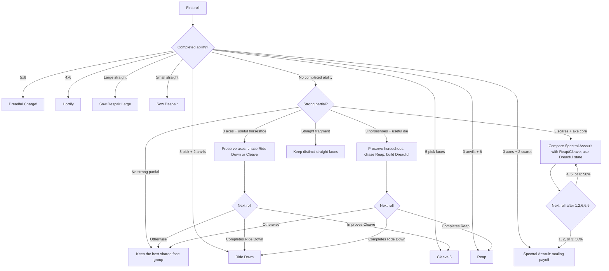

# Headless Horseman roll tree

The CLI generates a value-prioritized opening tree for Headless Horseman:

```powershell
dotnet run --project src\DiceThroneCli\DiceThroneCli.csproj -- rolltree `
  --hero headlesshorseman --dice-count 5 --rerolls 2
```

The generated tree contains 252 distinct five-dice opening patterns. The default ranking is expected delta, then completion probability, then opening frequency. It uses the shared evaluation model described in [ROLL_TREE_GENERATION.md](ROLL_TREE_GENERATION.md).

This chart now includes a strategy overlay: use the generated line as the roll-phase baseline, then account for Dreadful, Grim Pursuit, and Haunted Head state before committing. The published strategy emphasizes building Dreadful early, using Reap as reliable undefendable chip, using Ride Down to stock Grim Pursuit, and treating Spectral Assault as a scaling payoff rather than a fixed-damage attack.

## First-roll recommendation distribution

| Primary line | Opening patterns |
| --- | ---: |
| Ride Down | 103 |
| Reap | 50 |
| Spectral Assault | 43 |
| Cleave (5) | 21 |
| Sow Despair | 18 |
| Horrify | 14 |
| Sow Despair (Large) | 2 |
| Dreadful Charge! | 1 |

## Critical first-roll combinations

| Opening pattern | First-roll decision | Why it is a pivot |
| --- | --- | --- |
| 5×6 | Dreadful Charge! is complete | The ultimate is live for 14 undefendable damage and four Dreadful tokens. |
| 4×6 + anything | Horrify is complete | Four sixes give 6 undefendable damage and three Dreadful tokens. |
| 3 scares + an axe core | Consider Spectral Assault, but compare Reap/Cleave as the safe Dreadful line | Spectral Assault scales with stored Dreadful; do not evaluate it as a fixed 10-damage finish. |
| 3 pick faces + 2 anvils | Ride Down is complete | Three faces from 1/2/3 plus two faces from 4/5 complete the six-damage token line. |
| 3 anvils + 6 | Reap is complete | Three 4/5 faces and a 6 complete the undefendable Reap line. |
| 1-2-3-4 + anything | Sow Despair is complete | Preserve the completed small straight for 7 damage and a Dreadful token. |
| 1-2-3-4-5 or 2-3-4-5-6 | Sow Despair (Large) is complete | The large straight gives 9 damage and two Dreadful tokens. |
| 3+ axe faces without a stronger completion | Cleave is the reliable line | Cleave is the core attack and a safer way to convert a weak roll while preserving resources for later turns. |

## Strategy overlay

The roll tree is most useful when read with the following priorities:

- Early in the game, favor lines that build Dreadful. Reap is only 3 damage, but it is undefendable and adds two Dreadful, making later Spectral Assault and the defense more threatening.
- Ride Down is not just a six-damage result. Its two Grim Pursuit are a resource for extra roll attempts or an attack-damage boost, so it can be the better practical fork even when another line has similar immediate expected damage.
- Spectral Assault is a scaling payoff. Its post-activation die roll improves with Dreadful already held, so the generated `expectedDelta` is a baseline and should not be treated as the complete turn value.
- Horrify and Dreadful Charge! are the scare branch. Take the guaranteed undefendable damage when complete, but remember that the value of their Dreadful/Grim Pursuit choice depends on the current resource state.
- Cleave is the normal fallback when the high-end fork is too expensive. Preserve a good chance to activate an ability instead of forcing a low-probability Dreadful Charge!

## Expanded flow

Branch percentages below are conditional on reaching the preceding node. The generator groups equivalent sorted outcomes and exposes them as `nextRollSignals`.



For the representative state `1,2,6,6,6`, the generated entry keeps `1,2,6,6`, rerolls one scare, and reports a 75% completion probability for Spectral Assault. The strategy overlay says to compare that chase against the current Dreadful total and the value of a reliable Reap/Cleave result. Expanding that state is useful when inspecting the conditional second-roll branches:

```powershell
dotnet run --project src\DiceThroneCli\DiceThroneCli.csproj -- rolltree `
  --hero headlesshorseman --start-dice 1,2,6,6,6 `
  --rerolls 2 --include-next-roll
```

The tree is a decision aid based on dice objectives and configured outcome values. It does not model Dreadful count, Grim Pursuit spending, Haunted Head position, Terrorize timing, cards, opponent choices, armor state, or matchup-specific decisions. Those effects are intentionally shown as a strategy overlay rather than folded into the generated probabilities.
