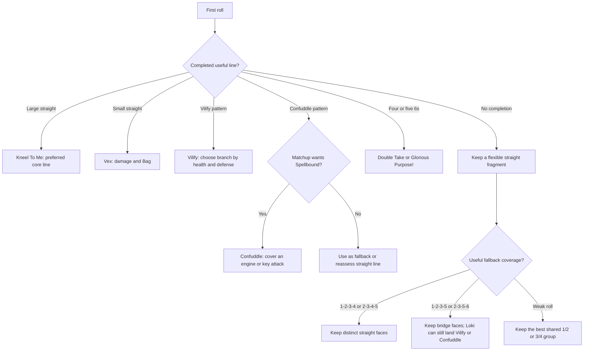

# Loki roll tree

Generate Loki's value-prioritized five-dice opening tree with:

```powershell
dotnet run --project src\DiceThroneCli\DiceThroneCli.csproj -- rolltree `
  --hero loki --dice-count 5 --rerolls 2
```

The tree uses the shared evaluation model in [ROLL_TREE_GENERATION.md](ROLL_TREE_GENERATION.md). It is a dice-phase decision aid: it models the listed roll objectives and their configured effects, but not Loki's upgrade level, card hand, dice manipulation, opponent matchup, or the choices made when resolving Illusion, Bag of Tricks, Vilify, or Kneel To Me.

## What the guide changes about the tree

Loki's best general plan is to chase straights, especially Kneel To Me. The value is not only the large straight itself: failed straight attempts commonly bridge into Vex, Confuddle, Vilify, or Antics. That makes Loki's fallback coverage unusually important. A raw value-first tree can still select a high-value 6-based line in some states, so treat those recommendations as a baseline and apply the guide's matchup and resource advice.

## Modeled objectives

| Objective | Roll pattern | Modeled result |
| --- | --- | --- |
| Mockery (3/4/5) | 3/4/5 dice showing 1 or 2 | 6/7/8 damage |
| Antics | Two 5s | Draw 1 card; gain Illusion and Bag of Tricks |
| Vex | Small straight | 7 damage; gain Bag of Tricks |
| Confuddle | Two 1/2 dice and two 3/4 dice | 7 damage; inflict two Spellbound |
| Vilify | One 1/2, one 3/4, one 5, and one 6 | 7 damage; gain Illusion and Bag of Tricks |
| Kneel To Me | Large straight | 9 damage baseline; gain Bag of Tricks |
| Double Take | Four 6s | 7 undefendable damage; gain Illusion and two Spellbound |
| Glorious Purpose! | Five 6s | 10 undefendable damage; gain Illusion, three Spellbound, and four Bags of Tricks |

Kneel To Me's 9 damage is an evaluation approximation for its follow-up roll. Vilify is represented by its common 7-damage branch; its actual choice depends on relative health and the opponent's defense. Those approximations keep the shared probability engine honest without pretending to solve the full resolution phase.

## First-roll distribution

After correcting the ultimate name, the default tree has 252 distinct five-dice histograms. The primary-line distribution is:

| Primary line | Opening patterns |
| --- | ---: |
| Confuddle | 130 |
| Antics | 62 |
| Vilify | 34 |
| Double Take | 19 |
| Mockery (5) | 6 |
| Glorious Purpose! | 1 |

The distribution is an artifact of the shared value-first scoring model. It does not mean Loki should always force Confuddle: the guide specifically recommends straight chasing and using Confuddle as a matchup-dependent control line or fallback.

## Practical roll priorities



The guide's key exceptions to ordinary straight play are to keep unusual bridge combinations such as 1-2-3-5 when the final die can still leave a useful Loki ability, and to avoid chasing 6s unless the 6-based line is already close or the payoff is decisive. Use dice modifiers to complete Kneel To Me more often; “two large straights are better than one ultimate” is the strategic reason.

## Representative branch

For `1,2,6,6,6` with two rerolls, the current baseline selects the four-6 line's shared 6 core:

```powershell
dotnet run --project src\DiceThroneCli\DiceThroneCli.csproj -- rolltree `
  --hero loki --start-dice 1,2,6,6,6 `
  --rerolls 2 --include-next-roll
```

The generated model keeps `6,6,6`, gives the 6-based line a 51.7747% completion chance, and retains Mockery as the fallback. In actual Loki play, the guide recommends comparing that line with a straight chase based on the opponent, available dice modifiers, and whether Double Take's Spellbound effect is more valuable than Kneel To Me's sustained flexibility.

## Strategy overlay from the guide

- Chase straights as the default. Kneel To Me is the preferred target, while Vex, Confuddle, Vilify, and Antics make misses productive.
- Prefer going second against ordinary opponents when Vilify's stronger branch benefits from being behind on health; go first when bypassing strong defenses matters more.
- Use Confuddle to cover engine abilities, double-straight abilities, late-game finishers, or easy attacks when Loki is near lethal.
- Spend early Bags on CP when the hand contains expensive cards; otherwise use Bags to extend health and stretch the game.
- Preserve Illusions and use them to deny burst damage. Aggressive opponents and early DPR are Loki's main counterplay, while status removal and CP disruption attack his resource engine.

The raw JSON emitted by `rolltree` remains the source of truth. This document is the human strategy overlay, including the guide's matchup and resource judgments that are outside the current dice-only calculator.
